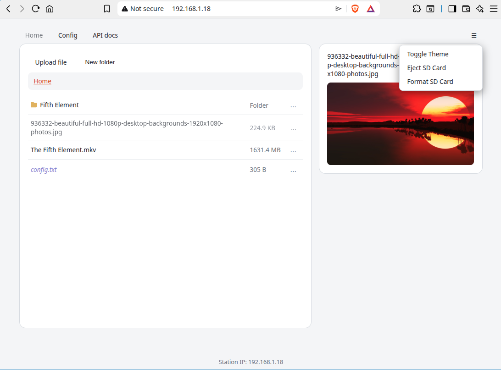

# WiFi USB Storage

Firmware for a Waveshare **ESP32-C6-LCD-1.47** (ST7789, 172x320 IPS) that turns a
microSD card into WiFi-accessible file storage, with hot-plug SD card support
and a small on-device status display.

## TODO

Waiting for a device with native USB support so I can make it behave like USB flash storage, so it can be used on a TV for playing videos while the video is being uploaded. Esentially a streaming feature for a non-smart TV.

## Hardware

- Board: ESP32-C6-LCD-1.47 (172x320 ST7789 LCD)
- Storage: microSD (TF) card over SPI, sharing the bus with the LCD (separate
  chip-selects; see `config.h` for pin assignments)
- Build: Arduino core via `arduino-cli` (`tools/build.sh` / `tools/build.sh upload`),
  "Huge APP" partition scheme

## Features

### WiFi
- **Access Point always available.** SSID is `WiFi_Storage<MAC>` (see
  `AP_NAME_PREFIX`/`AP_PASS` in `config.h`), IP `192.168.4.1`. This is how you
  first reach the device's web UI.
- **Station mode** to join your own WiFi: pick a network from a scan and enter
  its password on the `/config` page. Credentials (and screen brightness) live
  in RAM; they're mirrored to a file on the SD card (if one is present) so
  they survive a reboot. Without a card, they're RAM-only and are lost on
  power-cycle.
- **Automatic AP power-down**: once station mode is connected and no AP
  clients have been seen for a while (`AP_AUTO_OFF_MS`), the AP is switched
  off to save power. It comes back automatically if the station connection
  drops.
- The on-device LCD shows the AP's SSID/password/IP at boot, then switches to
  the station SSID/IP once connected, followed by the station's WiFi signal
  strength (RSSI, dBm), refreshed in place every 60s. The `/config` page also
  shows live RSSI (polled every 2s) - handy for testing router placement.
- **Upload throughput tracks WiFi signal strength closely.** At a weak
  station signal (~-74 dBm) uploads were bottlenecked to ~450-480 KB/s
  regardless of chunk size or upload method; moved close to the router
  (~-24 dBm) and throughput went above 600 KB/s - at that rate a 1GB file
  takes roughly 29 minutes (less on a stronger/less congested link). If
  uploads feel slow, check the RSSI reading before suspecting the SD card or
  code - a weak signal forces the radio down to a much lower PHY rate.

### SD card storage
- **Folders.** Create folders, navigate into them (breadcrumb trail at the
  top of the file list), and upload/move files into whichever folder is
  currently open. Nesting is unrestricted. Deleting a folder removes
  everything inside it, recursively.
- Upload, download, delete, move, and rename files (or folders) from the web
  UI or the HTTP API. Moving or renaming onto an already-taken name fails
  rather than silently overwriting.
- `config.txt` holds the saved WiFi credentials, screen brightness, and UI
  theme colors (see below) - it's a normal file, always sorted to the end of
  the file list and shown in a distinct color so it's easy to recognize.
  Nothing stops it being renamed/moved/deleted like any other file; doing so
  just means the device falls back to RAM-only WiFi/brightness/theme state
  until it's recreated.
- **Hot-plug.** The card doesn't need to be present at boot, and can be
  inserted or removed while the device is running - the web UI updates
  itself automatically (polls status every few seconds and reloads).
- **Fault detection.** The device distinguishes "no card inserted" from "a
  card is inserted but its filesystem can't be read" (corrupted/unformatted),
  using a raw SD hardware probe that's independent of the filesystem layer.
  The web UI shows which one it is.
- **Eject button.** Finishes any in-flight write and unmounts the card so it
  can be safely pulled out. The device won't try to remount it until it
  detects the card was actually removed, so clicking Eject while the card is
  still seated won't get silently undone.
- **Format button.** Wipes the card and lays down a fresh FAT filesystem -
  the fix for a "faulty" card. A confirmation dialog guards against
  accidental data loss.
- **Files larger than 4GiB.** FAT32 caps a single file at 4GiB-1, so any
  logical file that grows past `SD_PART_MAX_BYTES` (`config.h`, ~3.7GiB) is
  transparently split into hidden numbered part files plus a small manifest.
  This is invisible from the UI/API - uploads, downloads, listing, and
  deletion all work on the one logical file name and its true combined size.

### Web UI
- `/` - main page: station IP, folder-aware file list (breadcrumb trail,
  New Folder button), upload (multi-file, into whichever folder is open).
  Folders sort first, then files alphabetically, with `config.txt` always
  last and in a distinct color. When no SD card is present, or it's faulty,
  this area is replaced with the relevant message instead.
  - The **&#9776; menu** in the nav bar (top right, present on every page)
    has Toggle Theme, Eject SD Card, and Format SD Card. The latter two only
    appear on the main page when a card is actually present.
  - **Right-click (or long-press) a row**, or click the **`...`** button at
    the row's right edge, for a context menu: Download, Preview (images/text
    only), Move, Rename, Delete. The `...` button works with a mouse,
    keyboard, or TV remote, without needing a right-click. Left-clicking a
    previewable file's name opens the preview directly.
  - **Preview panel** on the right (drops below the file list on narrow
    screens): renders images (`jpg jpeg png gif svg webp bmp ico`) or the
    first 8KB of text-like files (`txt log csv json md ini cfg yaml yml
    xml`) inline. Has Previous/Next (cycles through previewable files in the
    current folder) and a Fullscreen toggle that keeps those controls
    visible.
  - **Move** opens a folder-browse dialog (its own breadcrumb) to pick a
    destination. Moving/renaming onto an existing name fails instead of
    overwriting.
- `/config` - WiFi network picker (scans, lets you pick an SSID and enter a
  password) and a screen brightness slider (capped at 50% actual PWM duty in
  firmware, regardless of the slider's 0-100% label - see `LCD_setBacklight`
  in `lcd_display.cpp`).
- `/api` - HTTP API reference page (see below).

### UI theme colors
The **Toggle Theme** entry in the nav bar's &#9776; menu switches between the
dark (default) and light color presets below, persisting the choice to
`config.txt` (`THEME=dark` or `THEME=light`).

The web UI's colors are stored in `config.txt` as `KEY=#rrggbb` lines below
the WiFi/brightness lines, each preceded by a `#` comment. Edit the file on
a PC (with the SD card removed from the device) to customize:

| Key | Default | Used for |
|---|---|---|
| `COLOR_BG` | `#11151c` | Page background |
| `COLOR_CARD_BG` | `#1b212b` | Card/panel background |
| `COLOR_BORDER` | `#232b37` | Card/table borders |
| `COLOR_TEXT` | `#e6e9ef` | Main body text |
| `COLOR_MUTED` | `#8b93a3` | Secondary/muted text |
| `COLOR_ACCENT` | `#ff5a3c` | Primary button / active nav background |
| `COLOR_ACCENT_HOVER` | `#ff6f55` | Primary button hover |
| `COLOR_LINK` | `#ff7a5c` | Hyperlink color |
| `COLOR_BTN` | `#2a3340` | Secondary button background |
| `COLOR_BTN_HOVER` | `#37424f` | Secondary button hover |

Missing or malformed lines fall back to the defaults above. Lines are
rewritten (in RAM values) any time WiFi credentials or brightness are saved,
so customized colors persist across those changes.

### HTTP API
All file/folder endpoints below take an optional `dir` query param (a
relative folder path, e.g. `Photos/2024`; omit or leave empty for root).

| Method | Endpoint | Description |
|---|---|---|
| GET | `/api/filelist?dir=DIR` | List entries as `name:size` for files or `name/:0` for folders (`\|`-separated) |
| GET | `/download?dir=DIR&name=NAME` | Download a file |
| GET | `/preview?dir=DIR&name=NAME` | Read up to the first 8KB of a file as plain text (used by the UI's text preview) |
| POST | `/upload` | Upload a file: raw body (not multipart), folder/filename via `X-Dir`/`X-Name` headers |
| GET | `/delete?dir=DIR&name=NAME` | Delete a file, or a folder and everything inside it |
| GET | `/mkdir?dir=DIR&name=NAME` | Create a subfolder |
| GET | `/move?dir=DIR&name=NAME&destDir=DEST` | Move a file into another folder; fails if the name is already taken there |
| GET | `/rename?dir=DIR&name=NAME&newName=NEW` | Rename a file or folder; fails if the new name is already taken |
| GET | `/eject` | Finish pending writes, unmount the SD card |
| GET | `/format` | Erase the SD card and create a fresh filesystem |
| GET | `/api/sdstatus` | `ready`, `faulty`, or `missing` |
| GET | `/api/sdspace` | `total:free` bytes on the SD card |
| GET | `/api/rssi` | Station WiFi signal strength (dBm) |
| GET | `/aplist` | Last WiFi scan result |
| GET | `/wifisave?s=SSID&p=PASS` | Save WiFi credentials, switch to station mode |
| GET | `/brightness?value=PERCENT` | Set screen illumination (0-100; actual duty is capped at 50% in hardware) |

## Known limitations
- File/folder names: up to 255 characters (FAT's long-filename cap),
  restricted to letters, digits, `. _ -` and space - other characters are
  silently stripped rather than rejecting the whole name.
- No exFAT support (disabled in the Arduino core's bundled FatFs), so the
  card is always formatted FAT16/FAT32 - the >4GiB split-file scheme above is
  what makes large files possible despite that.
- Names starting with `.` are reserved for internal use (split-file parts
  and manifests) and won't appear in the file list if uploaded directly.
- Text preview reads only the first 8KB of a file (`PREVIEW_MAX_BYTES` in
  `config.h`); larger text files are truncated in the preview panel (download
  still gets the whole file).

